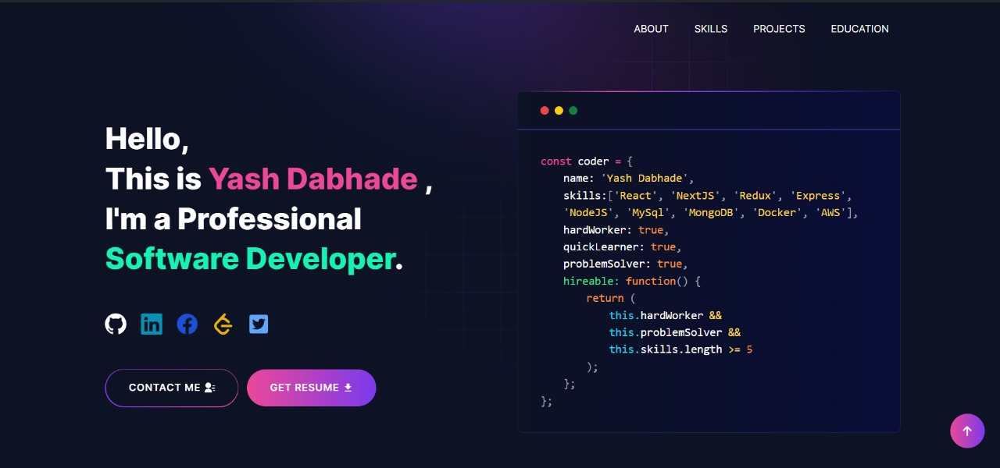

<h1 align=center>
    
</h1>

 

## 🧑‍💻 About Me:
- 🌱 Currently delving into full stack web development.
- 🔭 Competitive Programmer and Problem Solver
- 🎨 Enthusiastic about community involvement.

 

## 🤝 Connect with me:

 
 
 

## 🛠️ Languages and Tools :

  

 

## Online Judges Stats 
   

 
